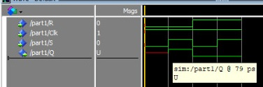

## Integrantes do Grupo

Ryan Diniz Pereira - 15590907
Vinícius Souza Freitas - 15491959

# **Parte 1:**

Primeiramente é necessário configurar o Quartus normalmente.  
Depois disso é necessário criar um vhd file, para fazer você vai em file e criar VHD, é importante lembrar que tem que colocar como top level para o Quartus saber que é para compilar aquele vhd.

Para colocar top level tem que ir em “project”-\>”set as top level entity”.

Para visualizar ele como circuito acesse tools e “netlist-viewer”


Esse circuito é uma implementação da gated RS latch usando NORS e ands, é a implementação padrão só que feita primeiramente em VHD.

A gated RS latch funciona como um latch normal, que armazena um bit, porém agora ela tem que é necessário que o clock esteja alto para que qualquer mudança seja efetuada sendo ela reset ou set. É importante lembrar que quando R e S são 0 o valor é indefinido (geralmente não permitido) e quando R e S são 1 o valor é o que era previamente, portanto, indefinido.  
Esse é o circuito como forma de [LUTS](https://en.wikipedia.org/wiki/Lookup\_table)!


As [LUTS](https://en.wikipedia.org/wiki/Lookup\_table) (look up tables) são como as nossas tabelas verdades, basicamente a fpga assinala uma tabela verdade na qual cada uma das funções lógicas são implementadas em uma dessas [luts](https://en.wikipedia.org/wiki/Lookup\_table), isso ocorre pois seria relativamente impossível implementar todas as funções booleanas.

Essa imagem é a implementação em uma única Lut, só que agora não podemos ver o valor do and


Agora é a parte do modelSim para iniciar você vai em file e cria um novo projeto, usa o vhd como componente do projeto

Depois, para simular é necessário compilar e depois ir em “simular”

Simulação da latch no ModelSim, é importante notar que quando o R é 0 e o S é 0 é indefinido.



# **Parte 2:** 


Este circuito é a implementação da D gated latch, que assim como a SR latch tem seu principal objetivo o armazenamento de memória. O seu funcionamento muda principalmente quando relacionado ao fato de agora ser controlado com apenas o “D”, quando o D for alto Q será alto também e seu conjugado será baixo, agora, quando D for baixo Q será baixo e seu conjugado alto.  

Isso implica que se não formos mudar o resultado de algo não é mais necessário ficar “resetando” os valores das latches antes da operação, tudo depende do clock e do D.

Simulação:


Código: 

```
library IEEE;
use IEEE.std_logic_1164.all;

entity part2 is
    port (
        Clk : in STD_LOGIC;
        D : in STD_LOGIC;
        Q : out STD_LOGIC
    );
end entity part2;

architecture rtl of part2 is
    signal S_g : STD_LOGIC;
    signal R_g : STD_LOGIC;
    signal Qnmrl : STD_LOGIC;
    signal Qcon : STD_LOGIC;
    attribute keep: boolean;
    attribute keep of S_g, R_g, Qnmrl, Qcon: signal is true;

begin
    S_g <= D nand Clk;
    R_g <= (not D) nand clk;
    Qnmrl <= S_g nand Qcon;
    Qcon <= R_g nand Qnmrl;

    Q <= Qnmrl;
    
end architecture rtl;
```

# **Parte 3:**  


O circuito representa um master slave D flip flop, que é outro componente de armazenamento composto de duas D latches. O funcionamento deste flip flop é o seguinte: é possível modificar o estado do flip-flop quando o clock está alto, entretanto a última mudança feita só tomará efeito quando o clock estiver negativo e em função disso é chamado de positive edge.

Simulação:  
  
 

Código:  

```
library IEEE;
use IEEE.std_logic_1164.all;

entity d_llatch is
    port (
        Clk : in STD_LOGIC;
        D : in STD_LOGIC;
        Q : out STD_LOGIC
    );
end entity d_llatch;

architecture Behaviour of d_llatch is
    signal S_g : STD_LOGIC;
    signal R_g : STD_LOGIC;
    signal Qnmrl : STD_LOGIC;
    signal Qcon : STD_LOGIC;

begin
    S_g <= D nand Clk;
    R_g <= (not D) nand Clk;
    Qnmrl <= S_g nand Qcon;
    Qcon <= R_g nand Qnmrl;

    Q <= Qnmrl;
    
end architecture Behaviour;

library IEEE;
use IEEE.std_logic_1164.all;

entity d_flip_flop is
    port (
        Clock : in STD_LOGIC;
        Entry : in STD_LOGIC;
        Res : out STD_LOGIC
    );
end entity d_flip_flop;

architecture Behaviour of d_flip_flop is
    
    component d_llatch is
        port (
            Clk : in STD_LOGIC;
            D : in STD_LOGIC;
            Q : out STD_LOGIC
        );
    end component;

    signal Qm : STD_LOGIC;
    signal Qs : STD_LOGIC;
    signal nclock : STD_LOGIC;
begin
    nclock <= not Clock;

    mstr : d_llatch port map(
        D => Entry,
        Clk => nclock,
        Q => Qm
    );

    slv : d_llatch port map(
        D => Qm,
        Clk => Clock,
        Q => Qs
    );
    
    Res <= Qs;
    
end architecture Behaviour;

```

# **Part 4:**  
A parte 4 apresenta três circuitos para nós, os quais são variações em armazéns de memórias.  
O primeiro circuito é o gated D latch normal o qual só muda seus valores quando o clock está alto.  
O segundo é o rising edge D flip flop o qual tem seu valor modificado apenas quando a onda está subindo. E mudando seu valor.  
O terceiro é o gated falling edge D flip flop que tem seu valor modificado apenas quando o clock vai de um valor alto para um baixo. Assim armazenando seu valor.

Aqui está a implementação na FPGA utilizando os registros dela:  


Simulação do circuito no modelsim:  


Código:

```
library IEEE;
use IEEE.std_logic_1164.all;

entity d_llatch is
    port (
        D : in std_logic;
        Clk : in std_logic;
        Q : out std_logic;
        Qcon : out std_logic
    );
end entity d_llatch;

architecture Behaviour of d_llatch is
begin
    process (D, Clk)
    begin
        if Clk = '1' then
            Q <= D;
            Qcon <= not D;
        end if;
    end process;
end architecture Behaviour;

library IEEE;
use IEEE.std_logic_1164.all;

entity pos_edge_flfp is
    port (
        D : in std_logic;
        Clk : in std_logic;
        Qa_1 : out std_logic;
        Qcon_1 : out std_logic
    );
end entity pos_edge_flfp;

architecture Behaviour of pos_edge_flfp is
begin
    process (Clk)
    begin
        if (rising_edge(Clk)) then
            Qa_1 <= D;
            Qcon_1 <= not D; 
        end if;
    end process;
end architecture Behaviour;

library IEEE;
use IEEE.std_logic_1164.all;

entity neg_edge_flfp is
    port (
        D : in std_logic;
        Clk : in std_logic;
        Qa_2 : out std_logic;
        Qcon_2 : out std_logic
    );
end entity neg_edge_flfp;

architecture Behaviour of neg_edge_flfp is
begin
    process (Clk)
    begin
        if (falling_edge(Clk)) then 
            Qa_2 <= D; 
            Qcon_2 <= not D;
	end if;
    end process;
end architecture Behaviour;

library IEEE;
use IEEE.std_logic_1164.all;

entity tr_flfp is
    port (
        Entry : in std_logic;
        Clock : in std_logic;
        Qs : out std_logic;
        Qscon : out std_logic;
        Qs_1 : out std_logic;
        Qscon_1 : out std_logic;
        Qs_2 : out std_logic;
        Qscon_2 : out std_logic
    );
end entity tr_flfp;

architecture Behaviour of tr_flfp is
    
    component d_llatch is 
        port (
            D : in std_logic;
            Clk : in std_logic;
            Q : out std_logic;
            Qcon : out std_logic
        ); 
    end component;

    component pos_edge_flfp is 
        port (
            D : in std_logic;
            Clk : in std_logic;
            Qa_1 : out std_logic;
            Qcon_1 : out std_logic
        );
    end component;

    component neg_edge_flfp is 
        port (
            D : in std_logic;
            Clk : in std_logic;
            Qa_2 : out std_logic;
            Qcon_2 : out std_logic
        );
    end component;
begin
    
    nmrl_dlatch : d_llatch port map(
        D => Entry,
        Clk => Clock,
        Q => Qs,
        Qcon => Qscon
    );

    nmrl_pos_edge : pos_edge_flfp port map (
        D => Entry,
        Clk => Clock,
        Qa_1 => Qs_1,
        Qcon_1 => Qscon_1
    );

    nmrl_neg_edge : neg_edge_flfp port map (
        D => Entry,
        Clk => Clock,
        Qa_2 => Qs_2,
        Qcon_2 => Qscon_2
    );
end architecture Behaviour;
```